# 🍽️ Sistema Web de Inventario, Ventas y Reservas – Restobar "La Pituca"

Aplicación web fullstack desarrollada para la gestión integral de un restobar, incluyendo control de inventario, ventas, reservas y autenticación de usuarios por roles.

---

## 📦 Repositorios

- 🔙 Backend: <https://github.com/MarkHM-studio/La-Pituca.git>
- 🔜 Frontend: <https://github.com/MarkHM-studio/restobar-lapituca.git>

---

## 🚀 Características principales

- Gestión de inventario (entradas y salidas de productos)
- Registro y control de ventas
- Sistema de reservas online
- Autenticación con JWT y OAuth2 (Google)
- Integración de pagos con Mercado Pago (sandbox)
- Exportación de datos a Excel
- Sistema multi-rol (admin, cliente, mozo, cajero, etc.)

---

## 👥 Roles del sistema

- **Administrador:** gestión del inventario y del sistema  
- **Cliente:** reservas y visualización  
- **Mozo:** gestión de pedidos  
- **Cajero:** registro de pagos  
- **Almacenero:** entradas de productos e insumos 
- **Cocinero / Bartender:** preparación de pedidos  
- **Recepcionista:** gestión de reservas  

---

## 🧱 Arquitectura

Arquitectura cliente-servidor basada en capas:

### Backend
Controller → Service → Repository → Entity → DTO

### Frontend
Componentes → Páginas → Servicios → Estado global (Zustand)

---

## 🛠️ Tecnologías utilizadas

### 🔙 Backend
- Java 17  
- Spring Boot  
- Spring Security (JWT + OAuth2)  
- Spring Data JPA  
- PostgreSQL / MySQL / H2  
- Mercado Pago SDK  

### 🔜 Frontend
- React 19 + Vite  
- TypeScript  
- Zustand (gestión de estado)  
- Axios (HTTP client)  
- React Hook Form + Zod  
- Tailwind CSS + Radix UI  
- Recharts  

### ⚙️ Herramientas
- Git & GitHub  
- Postman / JMeter  
- JUnit / Mockito  

---

## 📂 Estructura del proyecto

### 🔙 Backend

- `controller/` → Endpoints REST  
- `service/` → Lógica de negocio  
- `repository/` → Acceso a datos  
- `entity/` → Modelos de base de datos  
- `dto/` → Contratos de API  
- `security/` → JWT y OAuth2  

### 🔜 Frontend

- `components/` → Componentes reutilizables  
- `pages/` → Vistas por rol  
- `services/` → Consumo de API  
- `stores/` → Estado global (Zustand)  
- `hooks/` → Hooks personalizados  
- `types/` → Tipado global  

---

## 🖼️ Vista del sistema

### Página pública

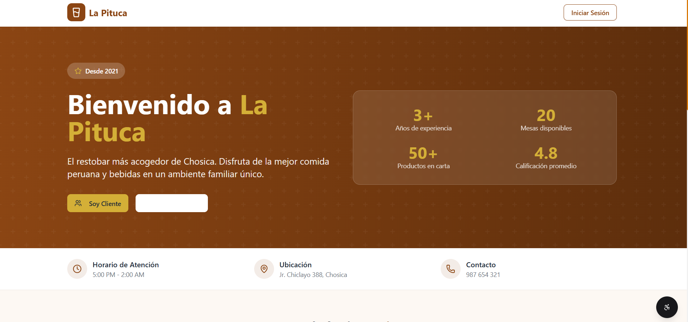  
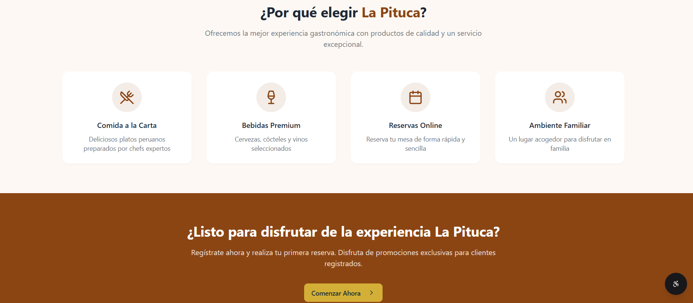  

### Sistema interno

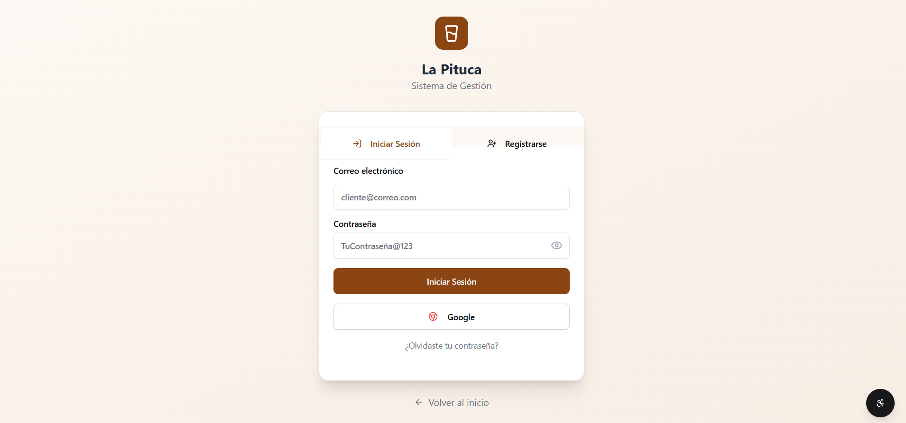  
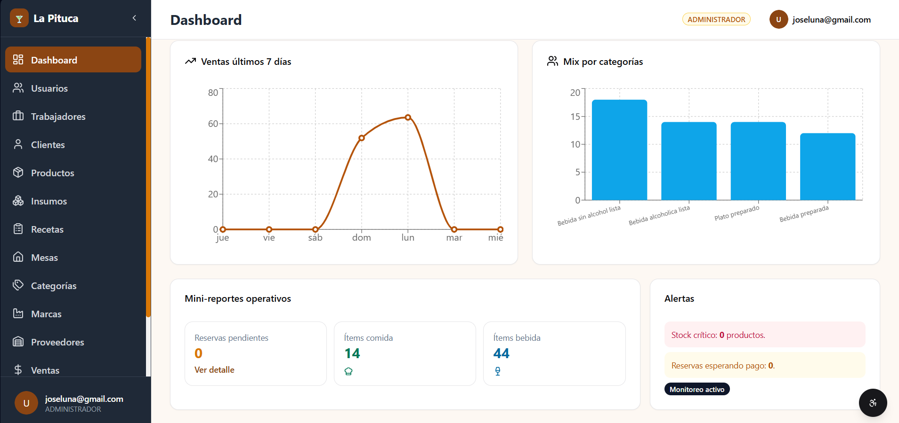  
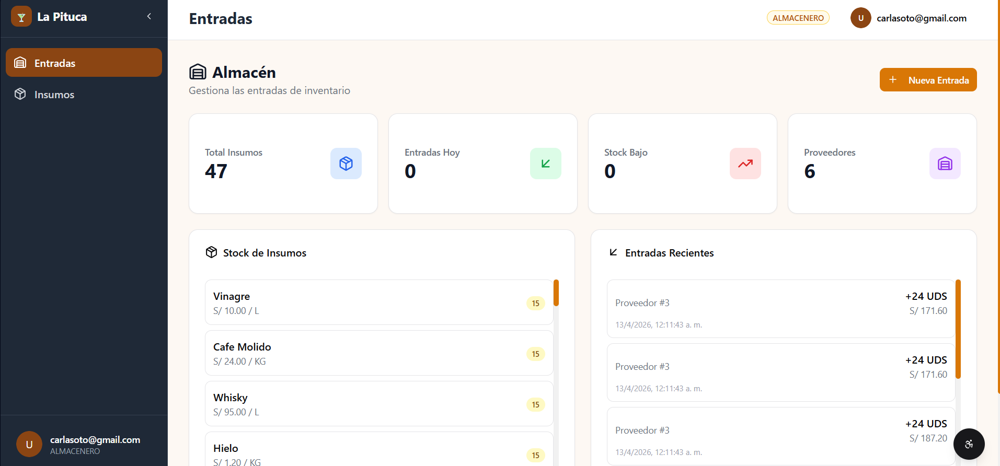  
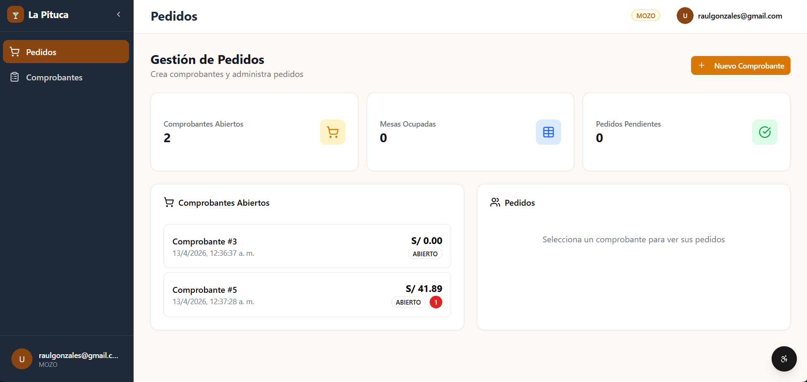  
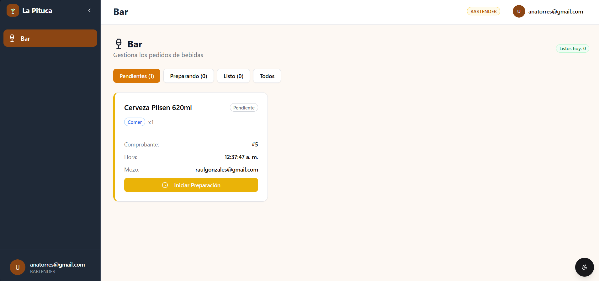  
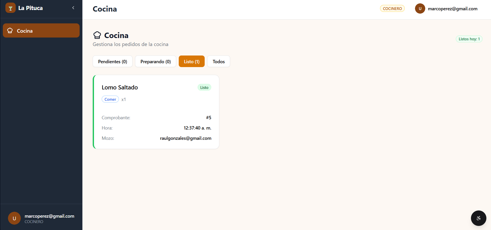  
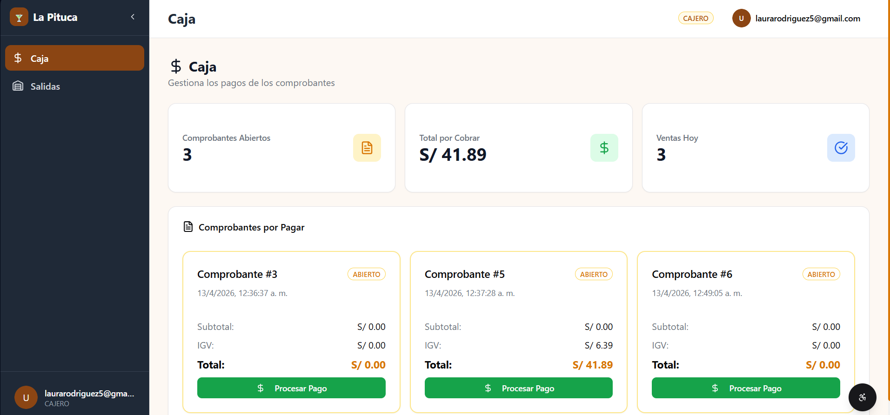  
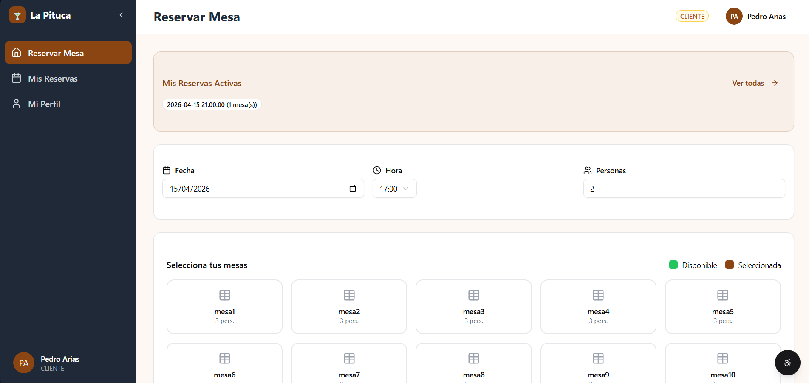  
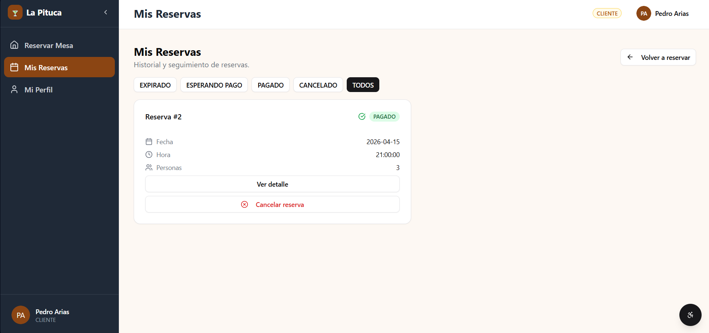  
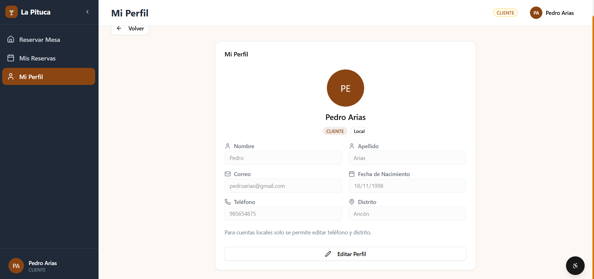  
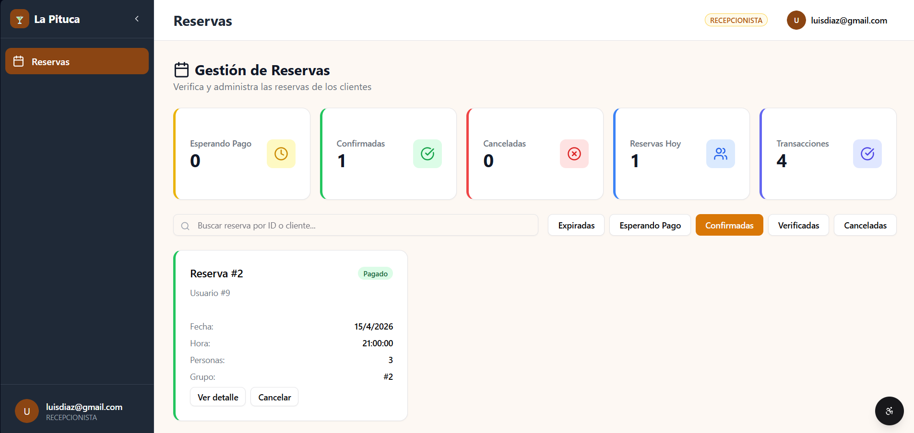  

---

## ⚙️ Instalación y ejecución

### 🔙 Backend

```bash
git clone https://github.com/MarkHM-studio/La-Pituca.git
cd backend
./mvnw clean install
./mvnw spring-boot:run
```

#### ⚙️ Configuración Backend

- Crear base de datos en PostgreSQL  
- Configurar credenciales en `application.properties` o variables de entorno:
  - JWT secret  
  - OAuth2 (Google)  
  - Mercado Pago  

### 🔜 Frontend

```bash
git clone https://github.com/MarkHM-studio/restobar-lapituca.git
cd frontend
npm install
npm run dev
```

---

## 📄 Documentación adicional

- ⚙️ Instalación detallada: ver `SETUP.md`
- 🧠 Documentación técnica: ver `INFO.md`

---

## 🔐 Seguridad

 - Autenticación mediante JWT
 - Login con Google (OAuth2)
 - Protección de rutas por roles
 - Manejo global de excepciones

 ---

## 📚 Aprendizajes

 - Implementación de arquitectura en capas
 - Autenticación híbrida (JWT + OAuth2)
 - Integración con APIs externas (Mercado Pago)
 - Gestión de estado en frontend con Zustand
 - Desarrollo de APIs REST escalables

 ---

## 📌 Notas importantes

 - El frontend depende del backend en ejecución
 - El proyecto utiliza credenciales sensibles (no incluidas en el repositorio)
 - Se recomienda el uso de variables de entorno para mayor seguridad

---

## 👨‍💻 Mi contribución

 - Desarrollo completo del backend
 - Diseño e implementación de la base de datos
 - Implementación de seguridad (JWT + OAuth2)
 - Integración con API de Mercado Pago
 - Desarrollo de endpoints REST y lógica de negocio

---

## 👨‍💻 Autor

 - Mark Anderson Huamani Morales
 - Desarrollador Backend en formación
 - 🔗 GitHub: https://github.com/MarkHM-studio
